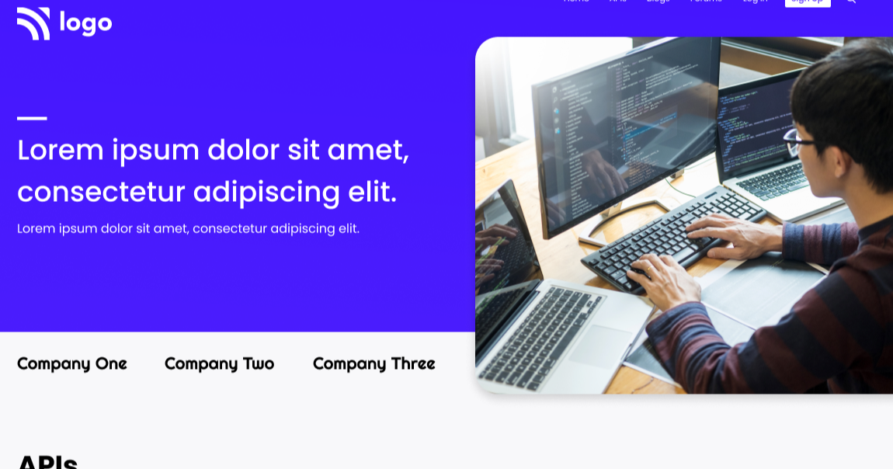

# Devloper Landing Page

### `Author` : **Rushikesh Dhanawade**

Made with ❤ in india

This is the User-Interface of Devloper Landing Page designed fully with HTML and CSS. The Landing page contains:

- Nabar
- Companies
- API Section
- Blog section
- FAQ SECTION
- Footer

# Learning Outcomes

- Handling background image.
- styling webpages using (only CSS).

# Preview

# Time taken to Complete

`4.5 hours`

# you can see Live here 😎

## 👉 [LIVE](https://rushi-devloper-landing-page.netlify.app/) 👈
